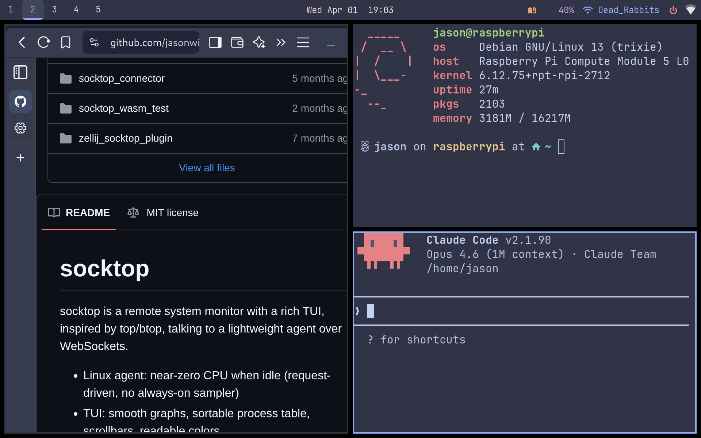

# sway-help

Sway window manager configuration with Catppuccin Frappe theme, a dynamic keybinding help overlay, and Claude Code integration.



## What's included

| Directory | Description |
|-----------|-------------|
| `sway/` | Sway config with Catppuccin Frappe window colors, idle lock, touchpad, NetworkManager |
| `waybar/` | Top bar with workspaces, clock, volume, network, backlight, battery, Claude, help + power buttons |
| `wofi/` | App launcher and help overlay styles |
| `foot/` | Terminal emulator with Frappe 16-color palette |
| `mako/` | Notification daemon themed to match |
| `swaylock/` | Lock screen with Frappe colored ring indicator |
| `gtk-3.0/` | GTK dark theme settings |
| `bin/` | `sway-help` and `claude-prompt` scripts |

## sway-help

The help overlay (`bin/sway-help`) parses your sway config every time it runs, so it always reflects your current keybindings. Access it via:

- **Mod+Shift+H** (keyboard shortcut)
- Click the keyboard icon in waybar

Type to filter, Escape to dismiss.

## Claude Code integration

Launch Claude Code directly from Sway:

| Binding | Action |
|---------|--------|
| **Mod+C** | Open Claude in a foot terminal |
| **Mod+Shift+C** | Quick prompt — wofi popup, type a question, Claude opens with it |
| **Waybar icon** | Left-click opens Claude, right-click opens quick prompt |

`claude-prompt` opens a minimal wofi input, takes your question, and launches Claude in foot with that prompt. The terminal stays open after Claude responds so you can continue the conversation.

## Install

```bash
# Copy configs
cp -r sway waybar wofi foot mako swaylock gtk-3.0 ~/.config/
cp bin/sway-help bin/claude-prompt ~/.local/bin/
chmod +x ~/.local/bin/sway-help ~/.local/bin/claude-prompt

# Dependencies
sudo apt install sway waybar wofi foot mako-notifier swaylock swayidle \
  grim slurp wl-clipboard network-manager-gnome brightnessctl
```

Claude Code must be installed separately — see [claude.ai/claude-code](https://claude.ai/claude-code).

## Dependencies

- sway, waybar, wofi, foot, mako, swaylock, swayidle
- grim, slurp, wl-clipboard (screenshots)
- network-manager-gnome (nm-applet)
- brightnessctl
- JetBrainsMono Nerd Font
- [Claude Code](https://claude.ai/claude-code) (for Mod+C / claude-prompt)
